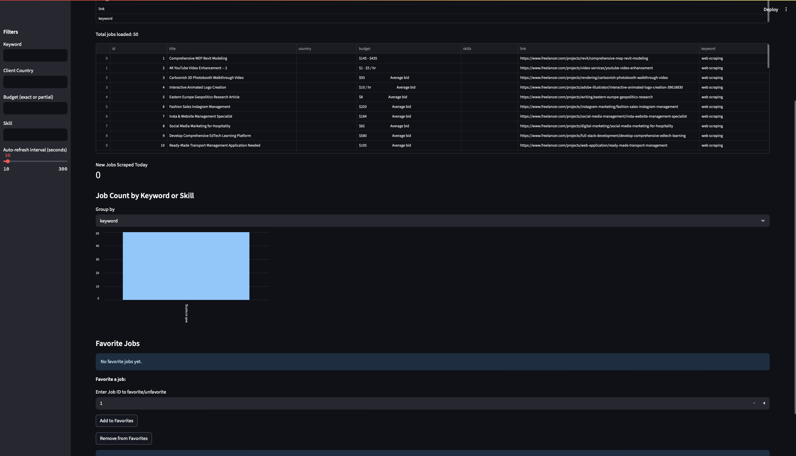

# GigPilot - Freelancer Job Scraper

GigPilot is a Python project that scrapes freelance job listings from [freelancer.com](https://www.freelancer.com) based on a list of keywords and provides a Streamlit dashboard for searching, filtering, and analyzing jobs.

<p align="center">
  
</p>

---

## 🚀 Features

- 🔍 Scrape jobs from Freelancer.com with selected keywords
- 🧠 Parse and structure data (title, country, budget, skills, snippet, etc.)
- 📊 Interactive Streamlit dashboard for filtering and visualization
- 💾 Saves scraped jobs in an SQLite database

---

## 📦 Requirements

Install required packages with:

```bash
pip install -r requirements.txt
```

---

## ⚙️ How to Use

1. **Activate virtual environment (optional but recommended)**  
   ```bash
   source venv/bin/activate
   ```

2. **Run the scraper**  
   You will be prompted to enter keywords:
   ```bash
   python scraper.py
   ```

3. **Launch the dashboard**  
   ```bash
   streamlit run dashboard.py
   ```

---

## 📂 Project Structure

```
GigPilot/
│
├── scraper.py              # Scrapes job data and saves to SQLite
├── dashboard.py            # Streamlit dashboard for data analysis
├── database.py             # DB setup and helper functions
├── data/                   # Contains screenshot and data samples
├── requirements.txt        # Python dependencies
└── README.md               # Project documentation
```

---

## 📸 Screenshot


---

## 📬 Contact

For questions or collaboration, reach out via [GitHub](https://github.com/hadiiskaargar)

---
## 📸 Screenshot


